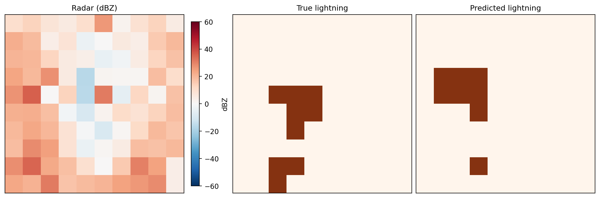

# Machine Learning for Radar-Based Lightning Nowcasting

This project explores whether radar observations alone contain sufficient information to predict short-term
lightning events. The work is a proof-of-concept study comparing different neural network architectures for 
binary lightning nowcasting, and how they perform with real-world data.

<div align="center">
  
</div>

**Project Links:**
- [Data processing pipeline](src/build_ml_dataset.py) - *Pipeline to generate radar and lightning feature-target pairs*
- [Machine learning pipeline](src/ml_pipeline.py) - *Pipeline to apply machine learning*
- [Full report](https://haraltho.github.io/lightning-nowcasting-deep-learning/) - *Main report describing methodology and results*

## Overview
The goal of this project is to evaluate the predictive power of radar reflectivity for short-term lightning nowcasting.

Key characteristics:

- Binary classification: lightning / no lightning
- 10x10 spatial grid (8 km resolution) tentered on Hurum radar station (Norway)
- Vertical resolution of 500 m (20 altitude levels)
- Configurable prediction window and lead time
- Comparison of three Tensorflow models:
    - 2D CNN (2D patterns only)
    - ConvLSTM2D (2D patterns + temporal evolution)
    - ConvLSTM3D (3D convolutions + temporal evolution)
- Evaluation using Critical Success Index (CSI), precision, and recall

The dataset covers lightning seasons from 2020-2025. The year 2025 is treated as a holdout year for qualitative evaluation.

## Repository Structure
```
src/
    create_lightning_targets.py     # Aggregates lightning data onto the grid
    create_radar_features.py        # Interpolates radar measurements onto the grid
    build_ml_dataset.py             # Processes raw data into feature-target pairs
    radar_utils.py                  # Helper functions to interpolate radar data
    lightning_utils.py              # Helper functions to grid lightning data
    ml_pipeline.py                  # Main ML pipeline runner
    ml_utils.py                     # Model definition and ML helper functions

data/config/
    storm_periods.csv               # File containing days and time periods for lightning events 
```

### Main runner file
The main script is:
```
src/ml_pipeline.py
```

This script:
1. Loads the preprocessed radar features and lightning targets.
2. Splits data into train, validation and test sets (split by day).
3. Normalizes inputs and handles class imbalance.
4. Trains the selected model architecture across multiple random seeds
5. Evaluates performance using CSI, precision, and recall
6. Performs evaluation on a holdout year.

All experiment configurations (model type, parameters, lead time, etc.) are defined at the top of `ml_pipeline.py`. 

The preprocessing pipeline `build_ml_datasets.py` executes the helper modules `create_lightning_targets.py` and 
`create_radar_features.py`, and is used to generate the intermediate datasets required by the ML pipeline.

Note: While the lightning data are publicly available, the radar data are proprietary data owned by MET Norway. Therefore,
this project is not directly reproducible without access to those datasets.

## Results
All three model architectures perform similarly.

- CSI values are similar across models.
- With a lead time of 0 minutes and a prediction window of 30 minutes, the following results are achieved:
    - Precision ranges approximately between 35-40%.
    - Recall is around 40%.
- The ConvLSTM2D model has the most balanced performance.

The full report for this project can be read [here](https://haraltho.github.io/lightning-nowcasting-deep-learning/).

---

## Acknowledgements
This work was carried out at the Norwegian Meteorological Institute. Lightning data were accessed via the FROST API. Radar data 
originate from the Hurum radar station.

